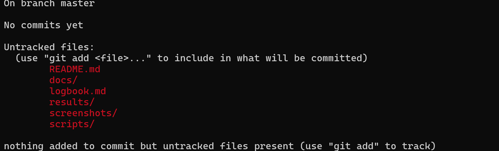
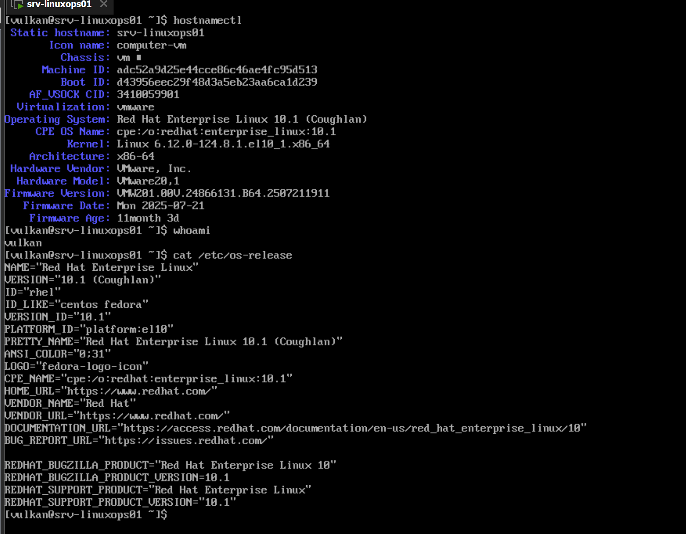
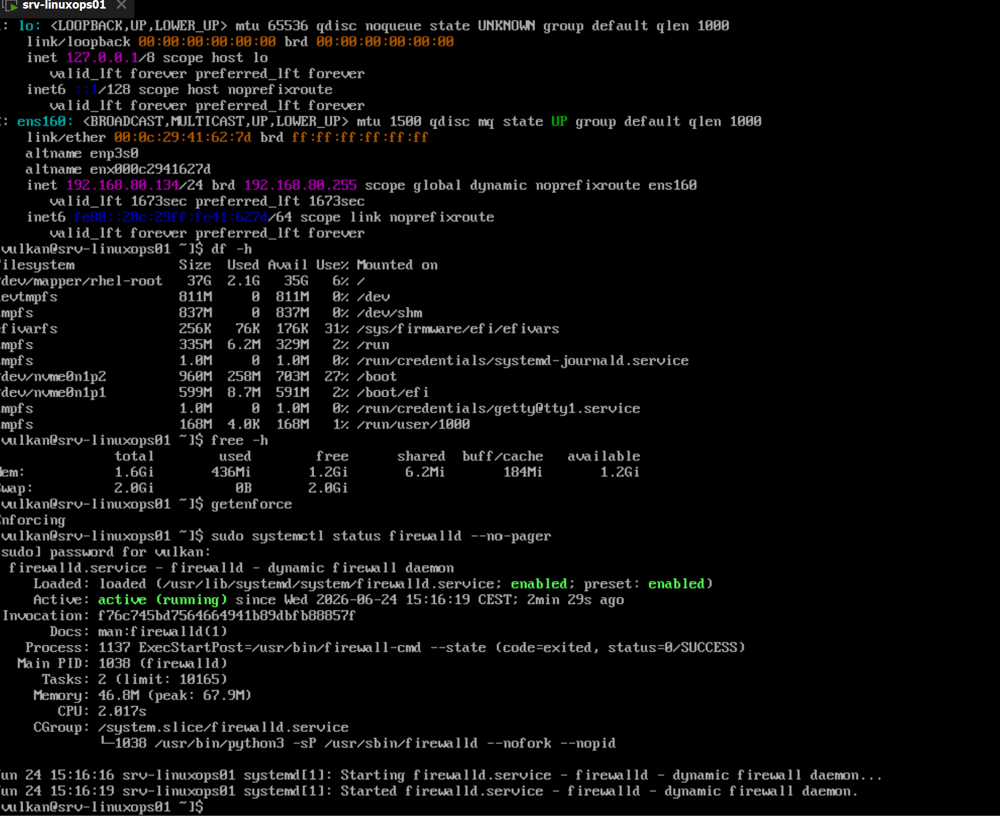
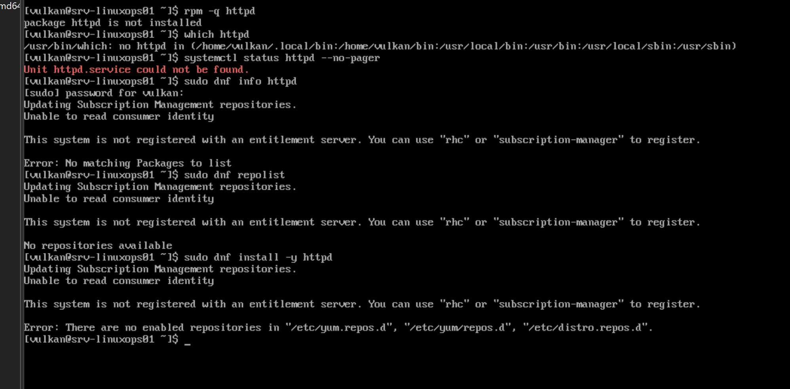
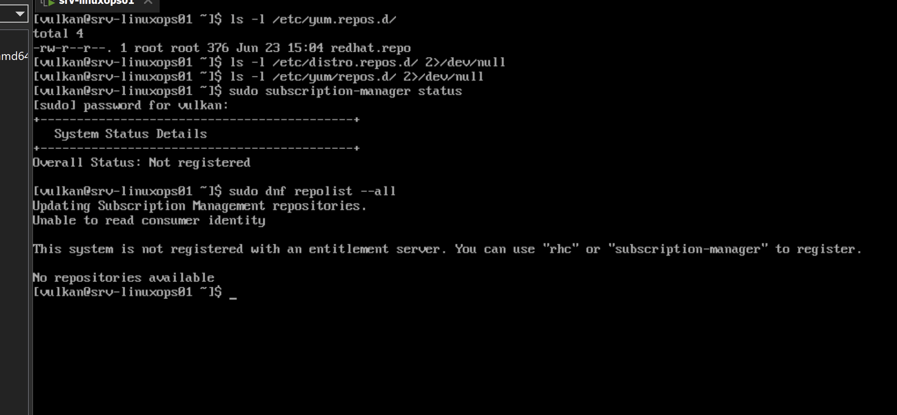
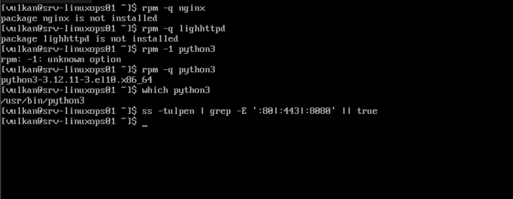
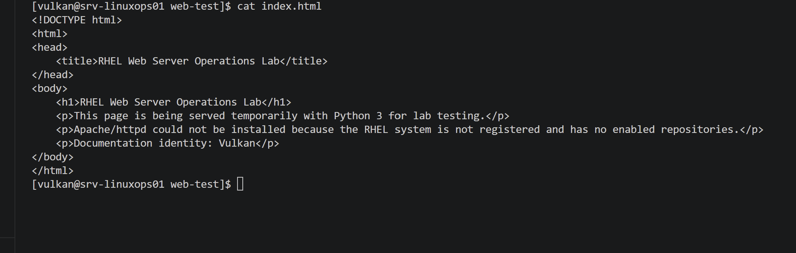
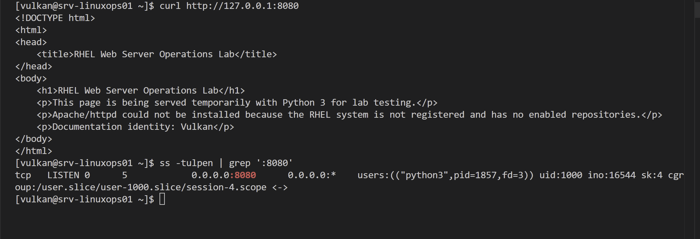

# RHEL Web Server Operations Lab — Logbook

## 2026-06-24 — Part 1: Repository setup and planning

### Goal

Start the RHEL Web Server Operations Lab by creating the local project structure, initial documentation files and Git repository.

### Work completed

* Created the local project folder.

* Created the main documentation folders:

  * docs
  * screenshots
  * scripts
  * results

* Created `README.md`.

* Created `logbook.md`.

* Created `.gitkeep` files so Git can track empty folders.

* Initialized the local Git repository.

* Verified the initial Git status.

* Prepared the project for the first commit.

* Created the GitHub repository.

* Connected the local repository to GitHub.

* Pushed the initial project structure to GitHub.

### Project structure

```text
RHEL-Web-Server-Operations-Lab/
├── docs/
│   └── .gitkeep
├── results/
│   └── .gitkeep
├── screenshots/
│   ├── .gitkeep
│   └── screenshot-01-project-structure-and-git-status.png
├── scripts/
│   └── .gitkeep
├── logbook.md
└── README.md
```

### Commands used

```powershell
cd C:\Users\rband
mkdir RHEL-Web-Server-Operations-Lab
cd RHEL-Web-Server-Operations-Lab

mkdir docs
mkdir screenshots
mkdir scripts
mkdir results

New-Item README.md
New-Item logbook.md

New-Item docs\.gitkeep
New-Item screenshots\.gitkeep
New-Item scripts\.gitkeep
New-Item results\.gitkeep

git init
git status
git add .
git commit -m "Initial project structure"
git remote add origin https://github.com/TheBoochy/RHEL-Web-Server-Operations-Lab.git
git branch -M main
git push -u origin main
git status
```

### Command purpose

| Command                                     | Purpose                                                               |
| ------------------------------------------- | --------------------------------------------------------------------- |
| `cd C:\Users\rband`                         | Moves PowerShell to the user folder.                                  |
| `mkdir RHEL-Web-Server-Operations-Lab`      | Creates the main project folder.                                      |
| `cd RHEL-Web-Server-Operations-Lab`         | Moves into the project folder.                                        |
| `mkdir docs`                                | Creates the documentation folder.                                     |
| `mkdir screenshots`                         | Creates the screenshot evidence folder.                               |
| `mkdir scripts`                             | Creates the script storage folder.                                    |
| `mkdir results`                             | Creates the command output and result storage folder.                 |
| `New-Item README.md`                        | Creates the main project README file.                                 |
| `New-Item logbook.md`                       | Creates the project logbook file.                                     |
| `New-Item .gitkeep`                         | Creates placeholder files so Git tracks empty folders.                |
| `git init`                                  | Initializes a local Git repository.                                   |
| `git status`                                | Shows repository status and untracked files.                          |
| `git add .`                                 | Stages all project files for commit.                                  |
| `git commit -m "Initial project structure"` | Creates the first local Git commit.                                   |
| `git remote add origin`                     | Connects the local repository to the GitHub repository.               |
| `git branch -M main`                        | Renames the current branch to `main`.                                 |
| `git push -u origin main`                   | Uploads the local `main` branch to GitHub and sets upstream tracking. |

### Notes

Git does not track empty folders by default, so `.gitkeep` files were added to the main project folders.

The first push initially failed because the GitHub repository had not been created yet. After the GitHub repository was created, the initial commit was pushed successfully.

This part prepares the project structure and documentation base for the rest of the lab.

The project will continue with RHEL baseline verification before any web server configuration is attempted.

### Evidence

Screenshot:



---

## 2026-06-24 — Part 2: RHEL server baseline verification

### Goal

Verify the current Red Hat Enterprise Linux server baseline before checking or configuring any web server services.

This baseline confirms the hostname, operating system, network configuration, disk usage, memory usage, SELinux mode and firewalld status.

### Work completed

* Verified the server hostname and system information.
* Verified the currently logged-in user.
* Verified the installed Red Hat Enterprise Linux version.
* Reviewed network interfaces and IP address information.
* Reviewed disk usage.
* Reviewed memory and swap usage.
* Verified SELinux mode.
* Verified firewalld service status.
* Saved screenshot evidence of the baseline verification.

### Commands used

```bash
hostnamectl
whoami
cat /etc/os-release
ip addr
df -h
free -h
getenforce
sudo systemctl status firewalld --no-pager
```

### Command purpose

| Command                                      | Purpose                                                                                |
| -------------------------------------------- | -------------------------------------------------------------------------------------- |
| `hostnamectl`                                | Shows hostname, operating system, kernel, architecture and virtualization information. |
| `whoami`                                     | Shows the currently logged-in user.                                                    |
| `cat /etc/os-release`                        | Displays the installed Linux distribution and version details.                         |
| `ip addr`                                    | Shows network interfaces, MAC addresses and IP addresses.                              |
| `df -h`                                      | Shows filesystem disk usage in human-readable format.                                  |
| `free -h`                                    | Shows memory and swap usage in human-readable format.                                  |
| `getenforce`                                 | Shows the current SELinux mode.                                                        |
| `sudo systemctl status firewalld --no-pager` | Shows whether the firewalld service is loaded, enabled and running.                    |

### Notes

The server baseline was verified before any web server package checks or service configuration.

This step is important because it provides a known starting point for the rest of the lab. If later web service, firewall or SELinux behavior changes, the baseline can be used for comparison.

SELinux and firewalld are especially important for this lab because web server access can be affected by both normal Linux configuration and security controls.

### Evidence

Screenshots:





---

## 2026-06-24 — Part 3: Web server package check

### Goal

Check whether Apache/httpd is installed on the RHEL server and verify whether the system can access repositories to install the web server package if needed.

This part confirms the current web server readiness state before attempting any service configuration.

### Work completed

* Checked whether the `httpd` package was installed.
* Checked whether the `httpd` command existed in the system path.
* Checked whether the `httpd` systemd service existed.
* Checked whether package information for `httpd` could be retrieved with `dnf`.
* Checked repository availability with `dnf repolist`.
* Attempted to install the `httpd` package.
* Confirmed that Apache/httpd could not be installed because the RHEL system is not registered and has no enabled repositories.
* Documented the package and repository limitation.
* Saved screenshot evidence of the package check and installation attempt.

### Verification results

| Item                         | Result                                                         |
| ---------------------------- | -------------------------------------------------------------- |
| `httpd` package status       | Not installed                                                  |
| `httpd` command availability | Not found                                                      |
| `httpd.service` status       | Unit could not be found                                        |
| `dnf info httpd`             | Failed / no matching package information available             |
| Repository status            | No repositories available                                      |
| Subscription status          | System not registered with an entitlement server               |
| `httpd` installation attempt | Failed                                                         |
| Reason installation failed   | No enabled repositories                                        |
| Web server configuration     | Not completed due to missing package and repository limitation |

### Commands used

```bash
rpm -q httpd
which httpd
systemctl status httpd --no-pager
sudo dnf info httpd
sudo dnf repolist
sudo dnf install -y httpd
```

### Command purpose

| Command                             | Purpose                                                                         |
| ----------------------------------- | ------------------------------------------------------------------------------- |
| `rpm -q httpd`                      | Checks whether the Apache/httpd package is installed.                           |
| `which httpd`                       | Checks whether the `httpd` command exists in the system path.                   |
| `systemctl status httpd --no-pager` | Checks whether the `httpd` service exists and whether it is running.            |
| `sudo dnf info httpd`               | Attempts to retrieve package information for `httpd` from enabled repositories. |
| `sudo dnf repolist`                 | Lists enabled software repositories.                                            |
| `sudo dnf install -y httpd`         | Attempts to install Apache/httpd without interactive confirmation.              |

### Notes

Apache/httpd was not installed on the server.

The `httpd` command was not found, and `systemctl` reported that `httpd.service` could not be found. This confirms that the Apache service is not currently available on the system.

The package lookup with `dnf info httpd` failed because the system could not access package information.

The repository check confirmed that no repositories are available. The installation attempt failed because the RHEL system is not registered with a Red Hat entitlement server and has no enabled repositories.

Because Apache/httpd could not be installed, normal web server setup cannot continue on this system until repository access is fixed.

This is a realistic system administration limitation. Future remediation would require registering the RHEL system with Red Hat subscription management or enabling a valid repository source before installing Apache/httpd.

This part demonstrates package verification, service readiness checking, repository troubleshooting and documentation of installation blockers.

### Evidence

Screenshot:



---

## 2026-06-24 — Part 4: Web service readiness and repository limitation review

### Goal

Review the system’s repository readiness and web service readiness after confirming that Apache/httpd is not installed.

This part checks whether repository configuration exists, whether the system is registered with Red Hat subscription management, whether any repositories are available, whether alternative web server packages are installed, whether Python 3 is available for temporary lab testing, and whether any common web ports are already listening.

### Work completed

* Checked repository configuration under `/etc/yum.repos.d/`.
* Confirmed that `redhat.repo` exists.
* Checked additional repository paths referenced by DNF error output.
* Checked Red Hat subscription status.
* Confirmed that the system is not registered.
* Checked all DNF repository availability with `dnf repolist --all`.
* Confirmed that no repositories are available.
* Checked whether Nginx is installed.
* Checked whether Lighttpd is installed.
* Checked whether Python 3 is installed.
* Verified the Python 3 command path.
* Checked whether any services were listening on common web ports `80`, `443` or `8080`.
* Saved screenshot evidence of repository readiness and web service readiness.

### Verification results

| Item                         | Result                                                       |
| ---------------------------- | ------------------------------------------------------------ |
| `/etc/yum.repos.d/`          | Contains `redhat.repo`                                       |
| `/etc/distro.repos.d/`       | No visible output / not available in checked command output  |
| `/etc/yum/repos.d/`          | No visible output / not available in checked command output  |
| Subscription status          | Not registered                                               |
| `dnf repolist --all`         | No repositories available                                    |
| Nginx package status         | Not installed                                                |
| Lighttpd package status      | Not installed                                                |
| Python 3 package status      | Installed                                                    |
| Python 3 version             | `python3-3.12.11-3.el10.x86_64`                              |
| Python 3 path                | `/usr/bin/python3`                                           |
| Listening on port 80         | No matching listener shown                                   |
| Listening on port 443        | No matching listener shown                                   |
| Listening on port 8080       | No matching listener shown                                   |
| Web service setup readiness  | Blocked for Apache/httpd due to missing package repositories |
| Temporary lab testing option | Python 3 is available                                        |

### Commands used

```bash
ls -l /etc/yum.repos.d/
ls -l /etc/distro.repos.d/ 2>/dev/null
ls -l /etc/yum/repos.d/ 2>/dev/null
sudo subscription-manager status
sudo dnf repolist --all

rpm -q nginx
rpm -q lighttpd
rpm -q python3
which python3
ss -tulpen | grep -E ':80|:443|:8080' || true
```

### Command purpose

| Command                                              | Purpose                                                                                 |
| ---------------------------------------------------- | --------------------------------------------------------------------------------------- |
| `ls -l /etc/yum.repos.d/`                            | Lists repository configuration files in the standard RHEL/YUM/DNF repository directory. |
| `ls -l /etc/distro.repos.d/ 2>/dev/null`             | Checks an additional repository path while hiding missing-directory errors.             |
| `ls -l /etc/yum/repos.d/ 2>/dev/null`                | Checks another possible repository path while hiding missing-directory errors.          |
| `sudo subscription-manager status`                   | Checks whether the RHEL system is registered with Red Hat subscription management.      |
| `sudo dnf repolist --all`                            | Lists all known repositories, including disabled repositories.                          |
| `rpm -q nginx`                                       | Checks whether Nginx is installed.                                                      |
| `rpm -q lighttpd`                                    | Checks whether Lighttpd is installed.                                                   |
| `rpm -q python3`                                     | Checks whether Python 3 is installed.                                                   |
| `which python3`                                      | Shows the executable path for Python 3 if available.                                    |
| `ss -tulpen \| grep -E ':80\|:443\|:8080' \|\| true` | Checks whether any service is listening on common web ports 80, 443 or 8080.            |

### Notes

The repository readiness check showed that `/etc/yum.repos.d/` contains a `redhat.repo` file. However, the system is not registered with Red Hat subscription management, and DNF reports that no repositories are available.

This means package installation through DNF is still blocked, even though a repository file exists.

The web service readiness check showed that Nginx and Lighttpd are not installed. Python 3 is installed and available at `/usr/bin/python3`.

The command checking ports `80`, `443` and `8080` returned no matching output. This means no service was shown listening on those common web ports at the time of testing.

An accidental command typo, `rpm -l python3`, returned an unknown option error. The command was corrected to `rpm -q python3`, which confirmed that Python 3 is installed. This correction was kept as part of the evidence because it shows normal troubleshooting during command-line work.

Because Apache/httpd, Nginx and Lighttpd are not installed, the lab cannot continue as a normal installed web server service configuration on this RHEL system.

The lab can still continue with temporary Python-based web testing in later parts. This will be documented clearly as a lab testing method, not a production web server replacement.

### Evidence

Screenshots:





---

## 2026-06-24 — Part 5: Temporary web content and Python HTTP server test

### Goal

Create temporary static web content and test local web serving with Python 3.

Because Apache/httpd could not be installed due to repository and subscription limitations, this part uses Python’s built-in HTTP server as a temporary lab testing method.

This is not a production web server replacement. It is used only to verify basic static web content and local HTTP access.

### Work completed

* Created a temporary web content folder under the `vulkan` user home directory.
* Created an `index.html` file for the lab web page.
* Verified that `index.html` exists.
* Verified the contents of `index.html`.
* Started Python’s built-in HTTP server on port `8080`.
* Opened a second SSH terminal for testing.
* Used `curl` to request the local web page from `127.0.0.1:8080`.
* Confirmed that the HTML page was returned successfully.
* Verified that Python was listening on port `8080`.
* Stopped the temporary Python HTTP server.
* Confirmed that the temporary server test was successful.
* Saved screenshot evidence of the web content and Python HTTP server test.

### Verification results

| Item                       | Result                          |
| -------------------------- | ------------------------------- |
| Temporary web folder       | `/home/vulkan/web-test`         |
| Web page file              | `index.html`                    |
| Web content creation       | Successful                      |
| Temporary server command   | `python3 -m http.server 8080`   |
| Test URL                   | `http://127.0.0.1:8080`         |
| Local curl test            | Successful                      |
| Returned content           | HTML page displayed in terminal |
| Listening port during test | `0.0.0.0:8080`                  |
| Listening process          | `python3`                       |
| Production web server used | No                              |
| Temporary lab test used    | Yes                             |

### Commands used

```bash
mkdir -p ~/web-test
cd ~/web-test

cat > index.html <<'EOF'
<!DOCTYPE html>
<html>
<head>
    <title>RHEL Web Server Operations Lab</title>
</head>
<body>
    <h1>RHEL Web Server Operations Lab</h1>
    <p>This page is being served temporarily with Python 3 for lab testing.</p>
    <p>Apache/httpd could not be installed because the RHEL system is not registered and has no enabled repositories.</p>
    <p>Documentation identity: Vulkan</p>
</body>
</html>
EOF

ls -l index.html
cat index.html

python3 -m http.server 8080
curl http://127.0.0.1:8080
ss -tulpen | grep ':8080'
ss -tulpen | grep ':8080' || true
```

### Command purpose

| Command                                | Purpose                                                                                  |
| -------------------------------------- | ---------------------------------------------------------------------------------------- |
| `mkdir -p ~/web-test`                  | Creates the temporary web content folder if it does not already exist.                   |
| `cd ~/web-test`                        | Moves into the temporary web content folder.                                             |
| `cat > index.html <<'EOF'`             | Creates the `index.html` file using heredoc input.                                       |
| `ls -l index.html`                     | Confirms that the web page file exists and shows permissions, owner, size and timestamp. |
| `cat index.html`                       | Displays the HTML file contents for verification.                                        |
| `python3 -m http.server 8080`          | Starts Python’s temporary HTTP server on port `8080`.                                    |
| `curl http://127.0.0.1:8080`           | Sends a local HTTP request to the temporary web server.                                  |
| `ss -tulpen \| grep ':8080'`           | Confirms that a process is listening on port `8080`.                                     |
| `ss -tulpen \| grep ':8080' \|\| true` | Checks whether port `8080` is still listening after the server is stopped.               |

### Notes

The `nano` text editor was not installed on the system, so the HTML file was created using a heredoc with `cat`.

This was appropriate because package installation is currently blocked by the system’s missing repository and subscription configuration.

The temporary Python HTTP server successfully served the static HTML page from `/home/vulkan/web-test`.

The `curl` test confirmed that the page was reachable locally through `http://127.0.0.1:8080`.

The `ss` check confirmed that Python was listening on `0.0.0.0:8080` during the test.

Python’s built-in HTTP server was used only as a temporary lab testing tool. It is not suitable as a production replacement for Apache/httpd.

This part demonstrates static content creation, temporary web service testing, local HTTP testing and listening port verification despite the Apache installation limitation.

### Evidence

Screenshots:




